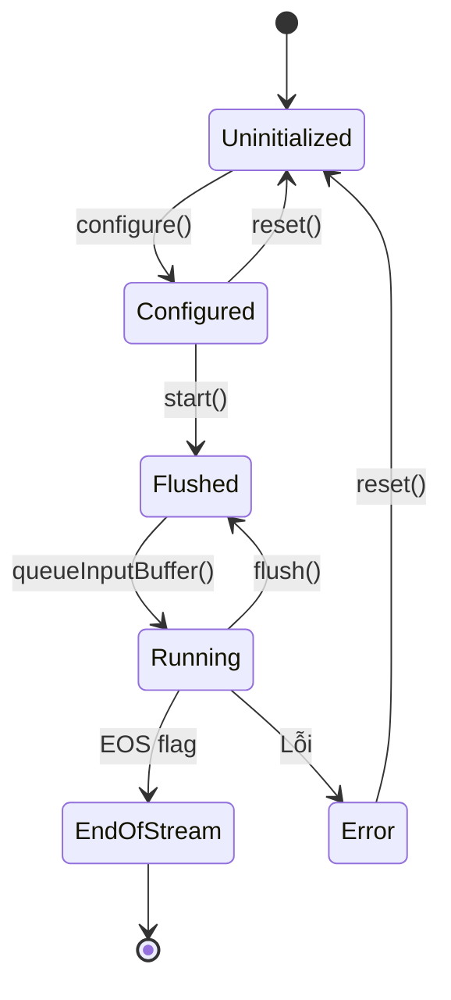

Dưới đây là giải thích chi tiết về **vòng đời (lifecycle) của Media Codec** dựa trên hình ảnh bạn cung cấp, tập trung vào các trạng thái và phương thức chuyển đổi trong chế độ **đồng bộ (Sync Mode)** hoặc **bất đồng bộ (Async Mode)**.

---

### **1. Các Trạng Thái Chính**
#### **① Uninitialized**  
- **Mô tả**: Codec vừa được tạo, chưa được cấu hình.  
- **Chuyển sang `Configured`**: Khi gọi `configure()`.  
- **Lỗi**: Có thể chuyển sang `Error` nếu cấu hình thất bại.  

#### **② Configured**  
- **Mô tả**: Codec đã được thiết lập thông số (ví dụ: resolution, bitrate).  
- **Chuyển đổi**:  
  - `start()` → `Flushed` (sẵn sàng nhận dữ liệu).  
  - `reset()` → Quay lại `Uninitialized`.  

#### **③ Flushed**  
- **Mô tả**: Bộ đệm (buffer) được làm sạch, chờ dữ liệu đầu vào.  
- **Phương thức quan trọng**:  
  - `dequeueInputBuffer()`: Lấy buffer trống để đẩy dữ liệu vào.  
  - `queueInputBuffer()`: Gửi dữ liệu đã nén (H.264/AAC) đến codec.  
  - `flush()`: Làm sạch lại bộ đệm (dùng khi seek video).  

#### **④ Running**  
- **Mô tả**: Codec đang xử lý dữ liệu (encode/decode).  
- **Chuyển sang `End of Stream`**: Khi nhận `BUFFER_FLAG_END_OF_STREAM` (EOS).  

#### **⑤ End of Stream (EOS)**  
- **Mô tả**: Đánh dấu kết thúc luồng dữ liệu.  
- **Hành động**: Codec hoàn thành xử lý các frame còn lại và tự động dừng.  

#### **⑥ Error**  
- **Mô tả**: Xảy ra lỗi (ví dụ: bitstream hỏng, hardware failure).  
- **Khắc phục**: Gọi `reset()` để khôi phục về `Uninitialized`.  

#### **⑦ Released**  
- **Mô tả**: Giải phóng tài nguyên codec.  
- **Trigger**: Gọi `release()`.  

---

### **2. Giải thích Các Phương Thức**
| **Phương Thức**          | **Mục đích**                                                                 | **Ví dụ**                          |
|---------------------------|-----------------------------------------------------------------------------|------------------------------------|
| `configure()`             | Thiết lập thông số codec (format, Surface cho output).                      | `codec.configure(format, surface, null, 0);` |
| `start()`                 | Bắt đầu quá trình xử lý dữ liệu.                                            | `codec.start();`                   |
| `dequeueInputBuffer()`    | Lấy chỉ số buffer trống để đẩy dữ liệu vào (blocking trong Sync Mode).      | `int inputBufIndex = codec.dequeueInputBuffer(timeout);` |
| `queueInputBuffer()`      | Gửi dữ liệu đã nén đến codec.                                               | `codec.queueInputBuffer(inputBufIndex, 0, size, timestamp, flags);` |
| `flush()`                 | Xóa bộ đệm, dùng khi cần reset dữ liệu (ví dụ: seek video).                 | `codec.flush();`                   |
| `reset()`                 | Đưa codec về trạng thái `Uninitialized` (sau lỗi).                         | `codec.reset();`                   |
| `release()`               | Giải phóng tài nguyên.                                                      | `codec.release();`                 |

---

### **3. Ví dụ Minh Họa: Decode Video H.264 (Sync Mode)**
```java
// 1. Khởi tạo và cấu hình
MediaCodec codec = MediaCodec.createDecoderByType("video/avc");
MediaFormat format = MediaFormat.createVideoFormat("video/avc", width, height);
codec.configure(format, surface, null, 0); // Surface để hiển thị output

// 2. Bắt đầu codec
codec.start();

try {
    while (!isEOS) {
        // --- PHÍA INPUT ---
        int inputBufIndex = codec.dequeueInputBuffer(TIMEOUT_US);
        if (inputBufIndex >= 0) {
            ByteBuffer inputBuffer = codec.getInputBuffer(inputBufIndex);
            int sampleSize = extractor.readSampleData(inputBuffer, 0);
            
            if (sampleSize < 0) {
                codec.queueInputBuffer(inputBufIndex, 0, 0, 0, MediaCodec.BUFFER_FLAG_END_OF_STREAM);
                isEOS = true;
            } else {
                codec.queueInputBuffer(inputBufIndex, 0, sampleSize, extractor.getSampleTime(), 0);
                extractor.advance();
            }
        }

        // --- PHÍA OUTPUT ---
        MediaCodec.BufferInfo bufferInfo = new MediaCodec.BufferInfo();
        int outputBufIndex = codec.dequeueOutputBuffer(bufferInfo, TIMEOUT_US);
        
        if (outputBufIndex >= 0) {
            codec.releaseOutputBuffer(outputBufIndex, true); // Hiển thị frame
            if ((bufferInfo.flags & MediaCodec.BUFFER_FLAG_END_OF_STREAM) != 0) {
                break;
            }
        }
    }
} finally {
    codec.stop();
    codec.release();
}
```

---

### **4. Sơ đồ Chuyển Đổi Trạng Thái**


---

### **5. Lưu ý Quan Trọng**
- **Sync Mode**:  
  - Các phương thức `dequeueInputBuffer()`/`dequeueOutputBuffer()` sẽ **block luồng** đến khi có kết quả.  
  - Luôn dùng ở **background thread** để tránh lag UI.  
- **Async Mode**:  
  - Sử dụng callback (ví dụ: `onInputBufferAvailable`).  
  - Hiệu suất tốt hơn cho ứng dụng real-time.  

Bạn đang gặp vấn đề cụ thể nào với codec? Mình có thể hỗ trợ sâu hơn!
